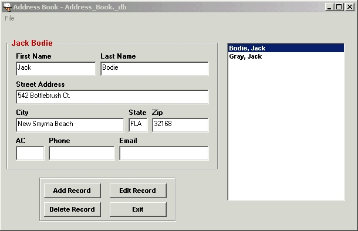



## My Address Book

### Description

PLEASE VOTE for this program! This personal address book is an excellent example of the use of sequential data manipulation and the code is fully documented with algorithm for the beginner. It demonstrates the use of the SaveAs and Open Common Dialog boxes. Arrays were used for text entry boxes and for command buttons. User defined Type is declared in the AddressBook form declaration section. Named constants are used to hold the text box and command button arrays. Data entered into the various text boxes is placed in a database file(*_db) OR text(.txt) file in a sequential manner. The data in the default *._db file is automatically loaded when the program is started. The functionality will allow the user to create new data files using the SaveAs Dialog allowing creation of various files such as Friends, Family or business data files.
 
### More Info
 
Fully documented for the beginner

             |
---                |---
**Submitted On**   |2002-04-06 10:01:16
**By**             |[Action Jackson](https://github.com/Planet-Source-Code/PSCIndex/blob/master/ByAuthor/action-jackson.md)
**Level**          |Beginner
**User Rating**    |5.0 (65 globes from 13 users)
**Compatibility**  |VB 6\.0
**Category**       |[Data Structures](https://github.com/Planet-Source-Code/PSCIndex/blob/master/ByCategory/data-structures__1-33.md)
**World**          |[Visual Basic](https://github.com/Planet-Source-Code/PSCIndex/blob/master/ByWorld/visual-basic.md)
**Archive File**   |[My\_Address69389462002\.zip](https://github.com/Planet-Source-Code/action-jackson-my-address-book__1-33521/archive/master.zip)

